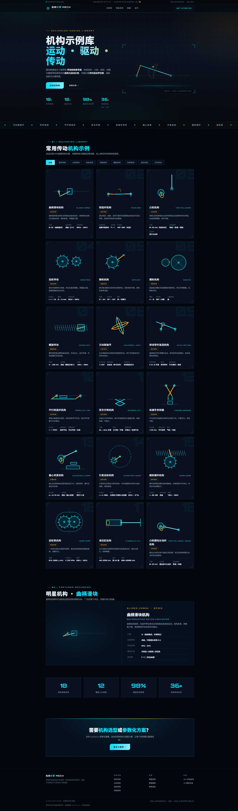

# ⚙️ 机械机构示例库 · MECH ENGINE

> 带 **实时运动学仿真** 的机械传动机构参考库 · 科技风展示网页

一款纯静态、单文件的科技风机构展示页，内置 **18 种经典机械机构** 的实时运动学仿真动画。所有机构都由 JavaScript 按真实几何关系逐帧求解（而非预设逐帧动画），辅助机械设计选型与方案构思。



<p align="center">
  
  
  
  
  
</p>

---

## ✨ 特性

- **实时运动学仿真** —— 曲柄滑块、四连杆连杆曲线、行星齿轮公转/自转、蜗轮蜗杆速比等均按真实几何实时计算，`requestAnimationFrame` 驱动
- **18 种机构 · 8 大分类** —— 连杆、凸轮、齿轮、间歇、螺旋、夹紧、液压、万向传动，支持分类筛选
- **详情弹窗** —— 点击任意卡片查看大图仿真 + 参数速查表
- **纯静态单文件** —— 无任何依赖、无需构建、无需联网，双击即可打开
- **科技风 HUD 视觉** —— Orbitron / Rajdhani / 思源黑体字体搭配，青色 + 琥珀主色，蓝图网格、扫描线、切角按钮、角标光效
- **动效完善** —— 数字滚动、滚动显现、跑马灯（含 IntersectionObserver + 滚动兜底，兼容稳定）
- **响应式布局** —— 适配桌面 / 平板 / 手机

## 🔩 机构库一览

| 分类 | 机构 |
| --- | --- |
| 连杆机构 | 曲柄滑块 · 曲柄摇杆四连杆 · 转动导杆急回 · 平行四连杆 · 剪叉升降 |
| 凸轮机构 | 盘形凸轮（直动从动件）· 凸轮摆动从动杆 |
| 齿轮机构 | 齿轮传动 · 行星齿轮 · 蜗轮蜗杆 · 齿轮泵 |
| 间歇机构 | 棘轮 · 槽轮（Geneva） |
| 螺旋机构 | 螺旋传动（丝杠螺母） |
| 夹紧机构 | 机械手夹持器 · 偏心夹紧 |
| 液压机构 | 液压缸 |
| 万向传动 | 万向联轴节 |

## 🧩 技术亮点

- **纯原生实现**：HTML + CSS + 原生 JS + SVG，无框架、无第三方库
- **运动学求解引擎**：
  - 曲柄滑块：由曲柄角实时解出滑块位置与连杆倾角
  - 四连杆：余弦定理求解 coupler，并实时描画连杆曲线
  - 行星齿轮：公转 + 自转（含速比换算），虚线内齿圈示意
  - 蜗轮蜗杆 / 齿轮泵 / 导杆急回等均含对应传动关系
- **动效兜底**：数字计数与滚动显现同时使用 IntersectionObserver 与滚动检测，保证各环境稳定触发
- **无障碍细节**：按钮含 `aria-label`，SVG 带 `aria-label` 描述

## 🚀 使用

```bash
# 直接打开（无需安装任何东西）
open index.html        # macOS
start index.html       # Windows
```

或部署到 GitHub Pages / 任意静态托管即可在线访问。

## 📁 目录结构

```
机械机构示例科技风网页/
├── index.html          # 全部代码（结构 / 样式 / 仿真逻辑）
└── assets/
    └── screenshot.jpg  # README 预览图
```

## 🛠 如何新增一个机构

项目为单文件架构，扩展机构只需在 `index.html` 的 `MECHANISMS` 对象中新增一条：

```js
'my-mechanism': {
  name: '机构名称',
  en: 'MECH-EN',
  cat: '所属分类',            // 需与 CATS 数组中的分类一致
  idx: '19',
  desc: '一句描述',
  params: [['参数','值'], ['典型应用','...']],
  build(svg) {
    // 1. 用 el() 在 svg 中创建机构图元
    // 2. 返回 function(t)，每帧按运动学更新图元属性
    return (t) => { /* 更新图元 */ };
  }
}
```

并在 `CATS` 数组（若为新增分类）与跑马灯 `items` 数组中加入对应名称即可。

## 🌐 部署到 GitHub Pages

1. 新建仓库并推送本目录内容
2. `Settings → Pages → Branch: main / (root) → Save`
3. 访问 `https://<用户名>.github.io/<仓库名>/` 即可

## 🙏 参考

- 机构分类与动画灵感参考：[迪威模型 3dWhere.com](https://www.3dwhere.com/movieslist) · 机械动画库

## 📄 License

[MIT](LICENSE)
